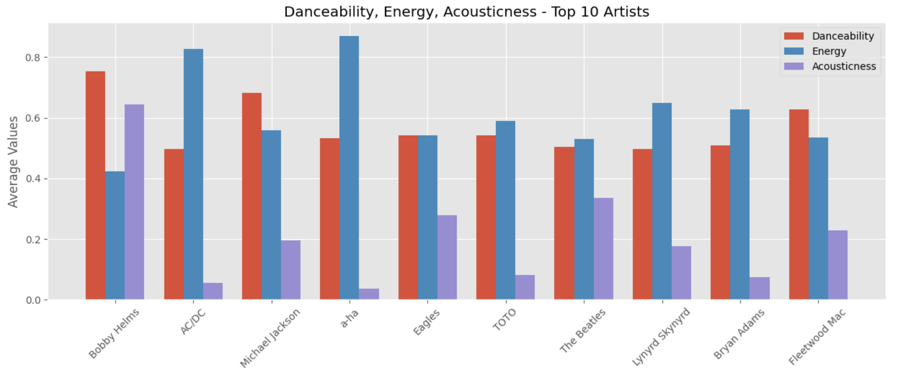
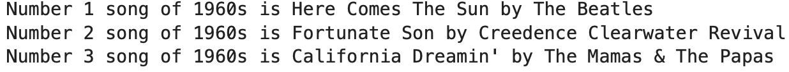
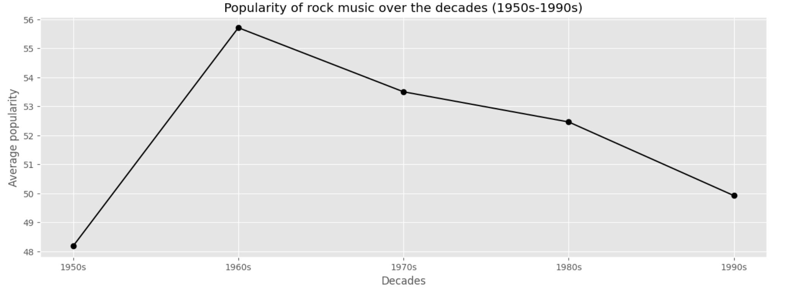

# **Rock Music Analysis**

## **Description**

This project explores the evolution of rock music between the years (1956- 1999) using Spotify data from [this Kaggle dataset](https://www.kaggle.com/datasets/lukaszamora/history-of-rock-19502020).

The dataset contains information about 5,000+ songs including their name, artist, release year, popularity score, and various audio features such as energy, danceability, etc.

This project focuses on patterns in **popularity, energy, danceability, and acousticness** of songs across decades.

The analysis was done using **Python (Numpy, Pandas, Matplotlib, Seaborn)** to uncover key trends and insights.

## **Analysis steps followed**

- Data Understanding (understanding the dataset and its contents)
- Data Preparation (data preparation includes cleaning and organizing the dataset before analysis)
- Exploratory Analysis and Visualization (we understand the data patterns, trends, and relationships and explore the dataset)
- Asking and Answering Questions (answering questions about the data using a plot or statistic)

## **A few questions asked and their answers from the data**

### Question: Observe the average danceability, energy and acousticness of top 10 artists (1956-1999)
### Answer:

### Question: The top 3 song from 1960s
### Answer:

### Question: Observe popularity of rock music by decades 1950s, 1960s, 1970s, 1980s, and 1990s
### Answer:

## **View notebook**
To explore all the findings and observe more such interesting insights view the entire notebook.

[Link to the Jupyter notebook](https://colab.research.google.com/drive/1Nhwz-1X2uCcY36jDWNT2VN4Yuf9HvLMN?usp=sharing)

[Link to PDF of the notebook](https://github.com/aayushmanmukherjee/RockMusicDataAnalysis/blob/main/rock_music_analysis_pdf.pdf)
